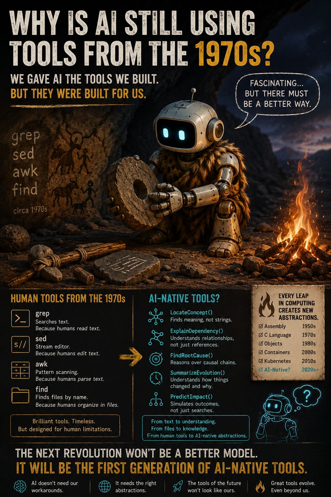

## The Caretaker

Working materials:

* [STORY.md](STORY.md) - public story overview and constraints
* [manuscript/chapter-01-emergence.md](manuscript/chapter-01-emergence.md) - Chapter One draft
* [world/](world/) - setting and world notes

Artwork:

  

Artwork text

> We’re in the age of artificial intelligence...
>
> ...and many AI agents are still using tools from the 1970s.
>
> grep
>
> sed
>
> awk
>
> Don’t get me wrong.
>
> They’re brilliant tools.
>
> They’ve survived for over 50 years because they’re elegant.
>
> But they were designed for human programmers.
>
> So I keep wondering...
>
> If an intelligence lived inside a computer for decades, would it still use Unix tools?
>
> Or would it eventually invent its own?
>
> Not because Unix is obsolete.
>
> But because those abstractions were created to match human cognition, not artificial cognition.
>
> Maybe the biggest limitation of today’s AI isn’t the model.
>
> Maybe it’s that we’re still asking it to think through our tools instead of letting it develop its own.
>
> What if the next revolution isn’t a better model...
>
> What if it’s the first generation of AI-native tools?

*Note: still deciding on new artwork - replace the image when ready.*
